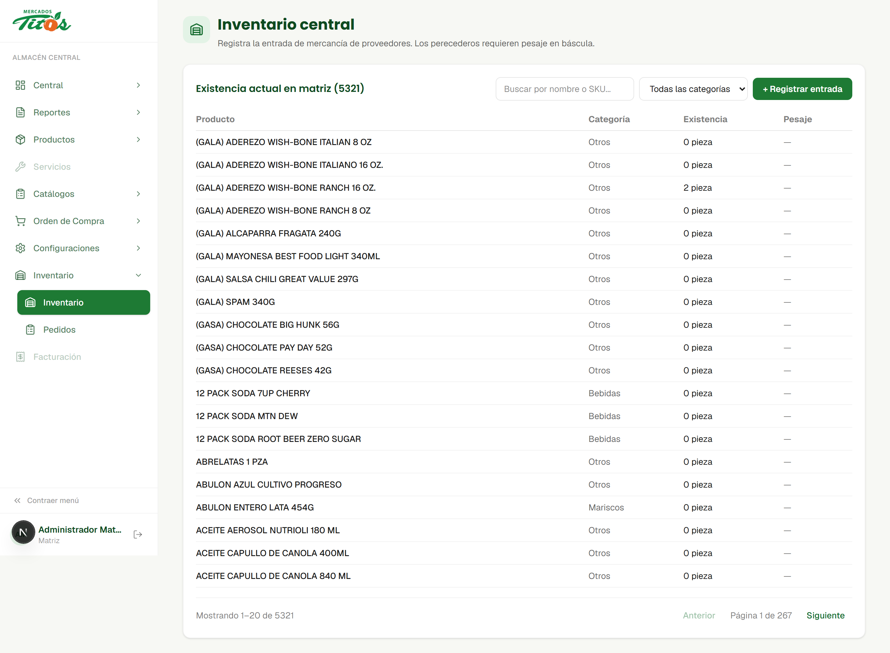
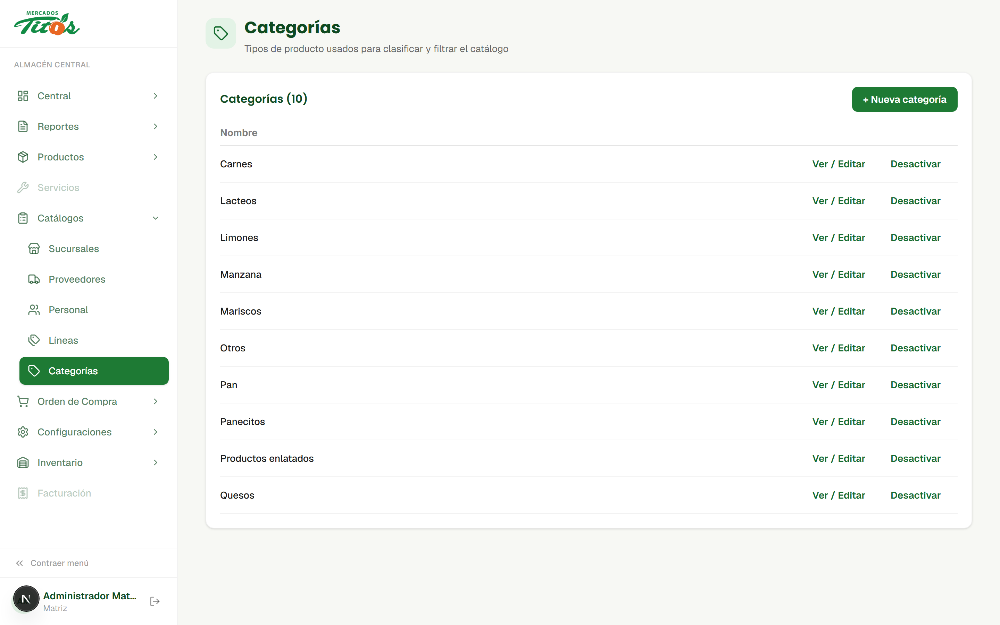
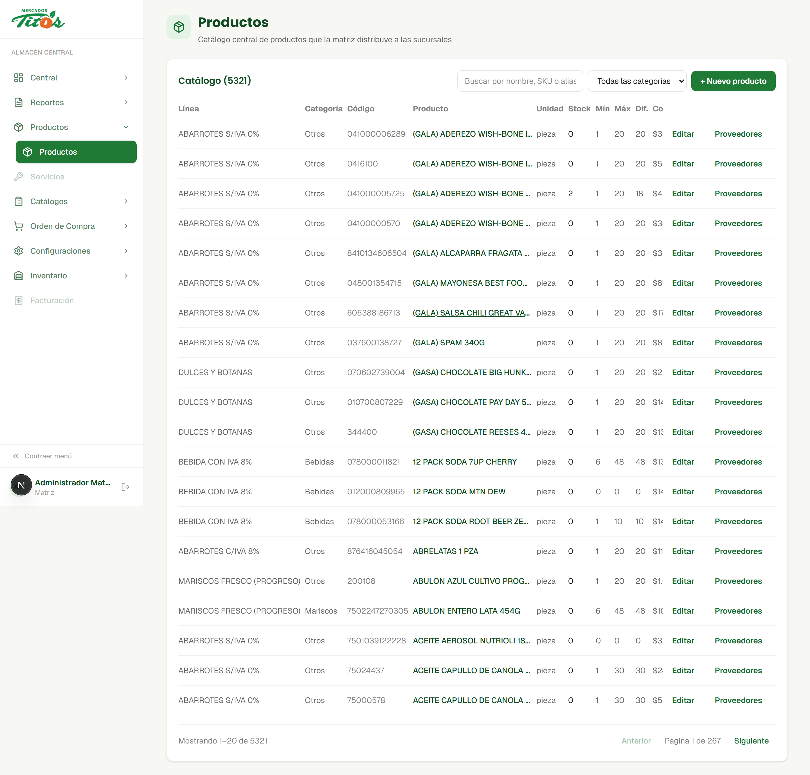
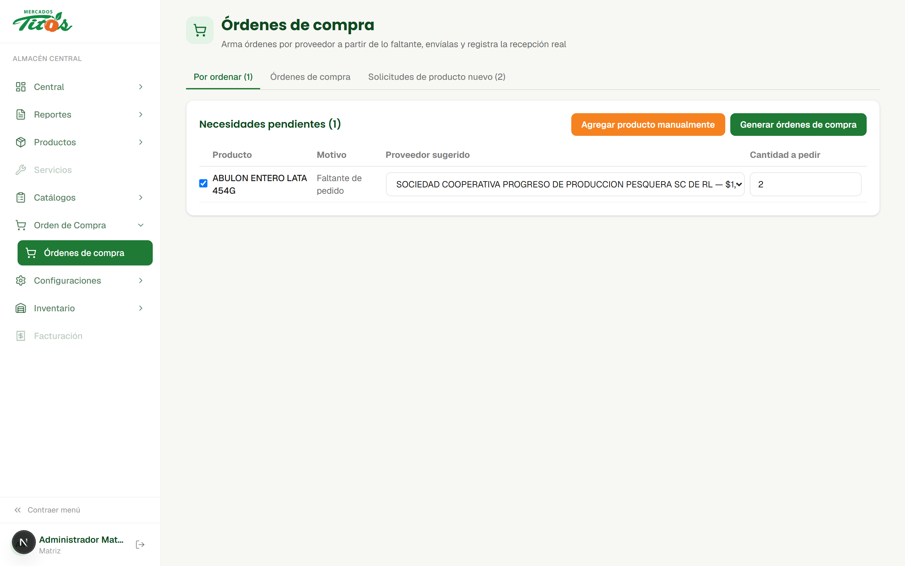
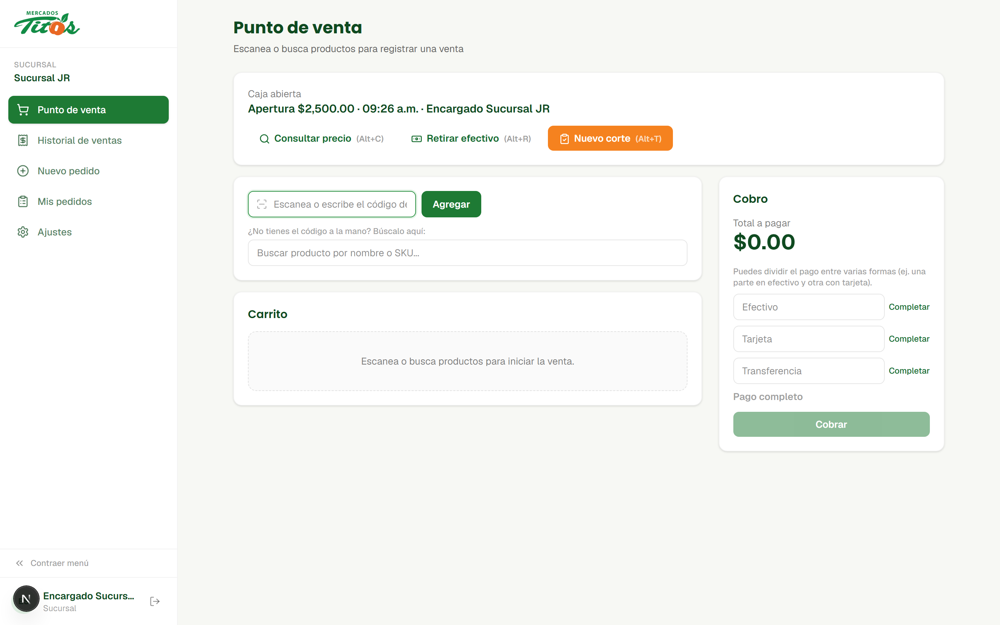
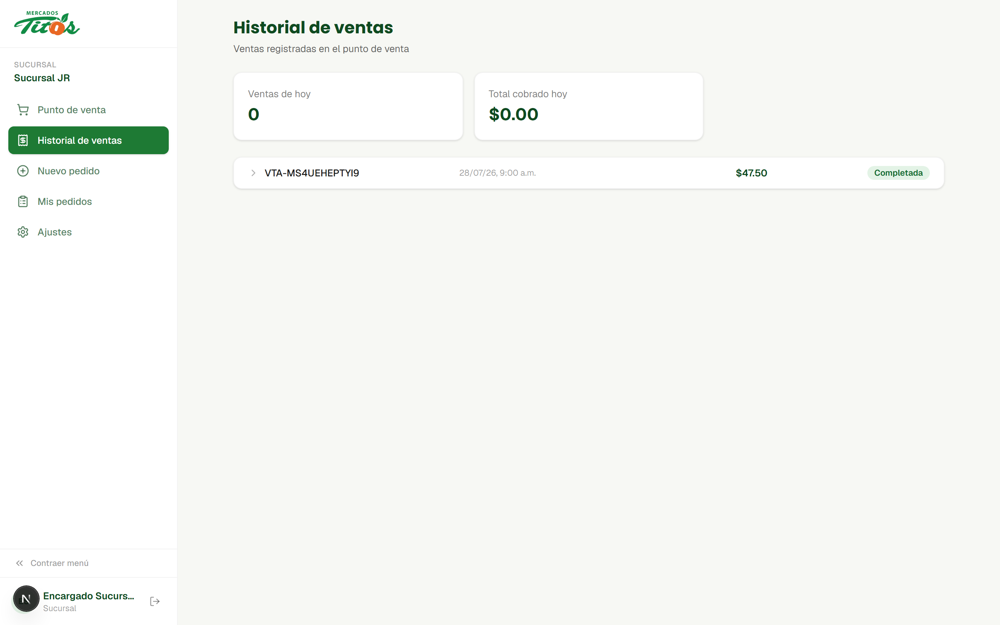
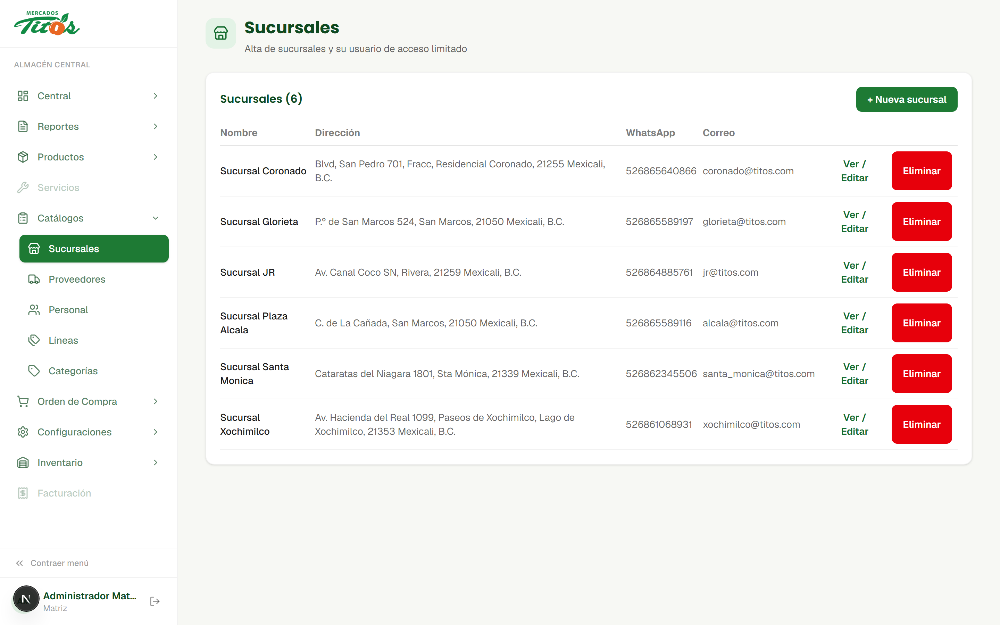
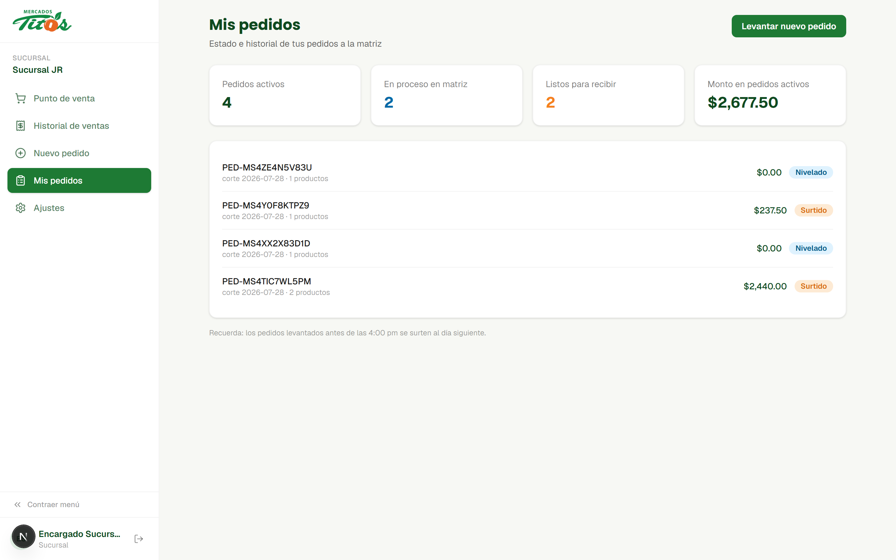

<!-- slide:cover -->
# Ajustes del periodo

## Mejoras aplicadas al sistema de Mercados Titos

Un repaso de lo que cambió en el almacén central y en las sucursales: inventario real, apertura de caja, punto de venta y ajustes al catálogo.

---

<!-- slide:section -->
# Inventario real

## De estimaciones a existencias que reflejan lo que hay en la bodega y en cada sucursal.

---

<!-- slide:content -->
## Qué cambió

- El inventario de matriz ahora refleja existencia real por producto, no solo lo que se pidió.
- Cada sucursal tiene su propio inventario, separado del de matriz, con su historial de movimientos.
- Se importó el catálogo completo de CEDIS y el inventario real de cada sucursal para arrancar con datos correctos.
- Se agregaron **categorías** y **líneas de producto** como catálogos propios, para clasificar y filtrar sin depender de texto libre.
- Cada producto puede tener uno o varios **proveedores** asociados, con su propio precio y código.
- Nueva tarjeta de **stock bajo**: avisa qué productos están por debajo de su mínimo y sugiere cuánto pedir.

---

<!-- slide:screenshot -->
## Inventario central
### Existencia real por producto, con búsqueda y filtro por categoría

---

<!-- slide:two-col -->
## Categorías y líneas

Dos catálogos nuevos para organizar los más de 5,000 productos:

- **Categorías**: agrupan por tipo (carnes, lácteos, mariscos, etc.).
- **Líneas**: agrupan por proveedor o marca, tal como llegan facturados.

Ambos se pueden crear, editar y desactivar sin tocar el catálogo de productos.

---

<!-- slide:screenshot -->
## Catálogo de productos
### Cada producto muestra su línea, categoría, stock mínimo/máximo y acceso directo a sus proveedores

---

<!-- slide:screenshot -->
## Órdenes de compra
### Arma órdenes por proveedor a partir de lo que realmente falta, envíalas y registra la recepción real

---

<!-- slide:section -->
# Caja y punto de venta

## Las sucursales ya pueden abrir caja, cobrar y llevar su propio historial de ventas.

---

<!-- slide:content -->
## Qué cambió

- Cada sucursal abre su caja capturando el efectivo inicial; queda registrada la hora y quién la abrió.
- El punto de venta permite cobrar dividiendo el pago entre **efectivo, tarjeta y transferencia** en la misma venta.
- Se puede **retirar efectivo** de la caja durante el turno, con motivo registrado.
- El **corte de caja** compara lo esperado contra lo contado y deja el resumen del turno.
- Nuevo **historial de ventas** por sucursal, con el detalle de productos y formas de pago de cada folio.
- El punto de venta funciona **sin conexión**: las ventas y movimientos de caja se guardan localmente y se sincronizan solos al recuperar internet.

---

<!-- slide:screenshot -->
## Punto de venta
### Caja abierta, cobro con formas de pago mixtas y carrito con búsqueda por código o nombre

---

<!-- slide:screenshot -->
## Historial de ventas
### Folio, hora, formas de pago y estado de cada venta registrada en la sucursal

---

<!-- slide:section -->
# Sucursales y pedidos

## Ajustes al catálogo de sucursales y a cómo se levantan y siguen los pedidos.

---

<!-- slide:content -->
## Qué cambió

- El catálogo de **sucursales** ahora administra también su usuario de acceso limitado desde la misma pantalla.
- El buscador de productos (usado al levantar pedidos y en el punto de venta) es más rápido y tolerante a errores de escritura.
- Ajustes a los formularios de productos y sucursales para reducir clics y evitar datos inconsistentes.
- La pantalla de **pedidos de sucursal** muestra de un vistazo cuánto está nivelado, cuánto sigue en proceso en matriz y el monto total activo.

---

<!-- slide:two-col -->
## Catálogo de sucursales

Alta y edición de sucursales junto con su usuario de acceso, todo desde una sola pantalla.

Seis sucursales activas hoy, cada una con su propio inventario, caja y punto de venta.

---

<!-- slide:screenshot -->
## Mis pedidos
### La sucursal ve el estado de cada pedido a matriz: nivelado, en proceso o surtido, con su monto

---

<!-- slide:stats -->
# El sistema en números

- **5,321**
  Productos en catálogo
- **34**
  Líneas de producto
- **10**
  Categorías
- **6**
  Sucursales activas
- **3**
  Formas de pago por venta
- **1**
  Punto de venta por sucursal, con y sin internet

---

<!-- slide:end -->
# Eso es todo por este periodo

## El almacén central y las sucursales ya operan con inventario real, caja formal y un catálogo más ordenado.

Cualquier duda sobre alguno de estos ajustes, con gusto la revisamos a detalle.
